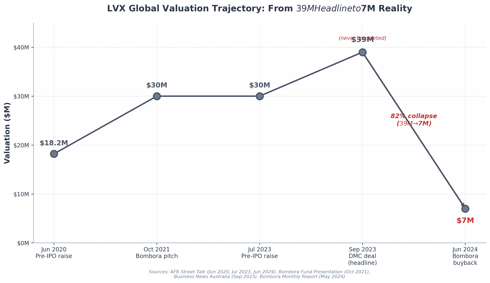

# Investigative Report: Smart Cities Council (SCC) and Corey Gray

*Independent evidence-based investigation conducted June 2026*

---

## Executive Summary

The Smart Cities Council (SCC) is not what it presents itself to be. An examination of corporate registrations, tax filings, securities disclosures, procurement records, and official databases across multiple jurisdictions reveals a pattern of systematic misrepresentation spanning legal identity, leadership credentials, operational record, and governance. The findings center on six conclusions.

**SCC is a privately held for-profit corporation, not a nonprofit or intergovernmental body.** The United States entity, Smart Cities Council, Inc., is a Virginia-incorporated for-profit private corporation with Employer Identification Number 38-3981098 — not a tax-exempt organization ^1^ ^2^. Its Australian subsidiary (ACN 619 159 625) is explicitly classified as "Not entitled to receive tax deductible gifts" ^3^. The term "Social Impact Organisation," which SCC applies to itself, is not a recognized legal category in any jurisdiction ^4^ ^5^. The organization's only appearance in IRS records is on a third-party Form 990 where it is the sole recipient among ninety-plus organizations with a blank Internal Revenue Code section — the filer could not identify any tax-exempt designation ^2^. The claim of being "headquartered in Washington, DC" is false; the registered address is in Reston, Virginia — 20 miles from the District ^6^ ^7^ ^8^.

**Corey Gray's central claim of "taking LVX Global public in 2020" is demonstrably false.** No record exists of LVX Global ever being listed on the Australian Securities Exchange. No ticker was assigned; no prospectus lodged ^9^. What occurred in June 2020 was a private pre-IPO capital raise to wholesale investors at 1.1 cents per share ^10^. LVX collapsed into voluntary administration on 27 March 2024, with all five group entities placed under external administration ^11^ ^12^. Bombora Investment Management bought the restructured business for $7 million — a 62% writedown — and confirmed it was "free from previous management / equity holders," meaning Gray was removed entirely ^13^ ^14^. That is not a successful exit.

**SCC has delivered zero independently verified physical infrastructure projects.** No government contract at any level was found across any procurement database ^15^. The "10,000+ projects" claim refers to the cumulative activities of SCC's corporate partners, not its own delivery ^14^. SCC's actual output is guidebooks, workshops, and conferences — knowledge products, not infrastructure implementation ^16^ ^15^. Its Smart Cities Academy is unaccredited; its Technology Accreditation Group is members-only and not independent ^17^ ^4^ ^18^. Its advisory services publish no client outcomes ^19^.

**Governance is essentially nonexistent.** SCC has no board of directors. TheOrg.com shows an empty organizational chart with Gray as the sole listed leader ^20^. Only two named staff appear on the website ^21^. A four-person advisory board was created in September 2025 — thirteen years after founding — with no published decision-making authority ^22^. Members have no voting rights and no mechanism to influence direction ^23^. No financial statements, annual reports, audited accounts, or conflict-of-interest policies are published ^2^ ^21^. Executive compensation is entirely undisclosed.

**Credential inflation is systematic.** Gray's biography inflates his film's award count from approximately eight verifiable wins to "14 international film awards" ^21^ ^24^ ^25^. It names the "Berlina Film Festival" and "Teddie" award — both misspelled, both dated 2024 rather than the actual 2023 ^26^ ^27^. He claims "Chair" of EB Research where IRS filings list him as Director ^28^. He claims "board member" at UN-ITU CitiVerse where the ITU lists him as a working-group contributor ^29^ ^30^. The "qualified scientist" claim is unsupported by any publication, patent, or verified degree ^31^ ^32^. Each claim contains a kernel of truth; the framing provides the inflation.

**Africa engagement is event-based; the "authoritarian dictator deals" allegation is unsubstantiated, but due diligence failures are real.** SCC's Africa activities are limited to conference partnerships in Kigali, Nairobi, and Marrakech, with no registered office, no government contracts, and no DFI involvement ^13^ ^17^ ^21^. No evidence of contracts with authoritarian regimes was found. However, SCC hosted DRC Minister Guy Loando Mboyo in May 2025 after the Organized Crime and Corruption Reporting Project had published documented corruption allegations against him, including $48 million in inflated highway budgets and undisclosed toll revenue ^33^ ^34^. SCC has no ethics policy, no compliance function, and no due diligence framework ^34^. The risk is not secret deals with dictators; it is an ungoverned organization facilitating introductions between vendors and officials from poorly governed states without institutional safeguards.

**The bottom line.** SCC is a small for-profit membership business — perhaps five to seven employees — that has been repositioned through language to appear as a quasi-public institution with global delivery capacity. It has no nonprofit status, no board, no audited financials, no verified projects, and no governance framework. Its President's central credential is false. Its claims are inflated. Its due diligence is absent. For a professional evaluating whether to affiliate or partner with SCC, the documentary record supports one conclusion: this organization markets a legitimacy it has not earned.

---

# 1. What SCC Actually Is — Legal Reality vs. Marketing Claims

The Smart Cities Council (SCC) describes itself as the "world's largest and longest-running membership-based Social Impact Organisation for Smart Cities, Smart Buildings, and Technology," a "public-private sector global Social Impact Organisation" headquartered in Washington, DC ^4^. These claims, repeated across press releases, partnership announcements, and the organization's own website, create an impression of institutional heft and public-purpose legitimacy. An examination of corporate registrations, tax filings, and business records across multiple jurisdictions reveals a fundamentally different entity: a privately held for-profit corporation with no nonprofit registration anywhere, no government affiliation, and no legal basis for the terminology it uses to describe itself.

---

## 1.1 The "Social Impact Organisation" Label

### 1.1.1 Virginia For-Profit Registration, Not a Nonprofit

The United States entity is legally registered as **Smart Cities Council, Inc.** — a Virginia-incorporated private for-profit corporation, not a nonprofit organization ^1^. Business directories consistently classify it as a "privately-held company" ^1^, and the organization was acquired in 2021 by an ASX-listed company as a commercial asset — a transaction that would be impossible for a genuine nonprofit ^35^.

The Employer Identification Number (EIN) on file with the Internal Revenue Service is **38-3981098** ^2^. This is a standard for-profit corporation EIN, not a tax-exempt organization identifier. Searches of IRS Publication 78 (the definitive list of organizations eligible to receive tax-deductible contributions), the IRS Business Master File, ProPublica Nonprofit Explorer, and Guidestar/Candid found no record of Smart Cities Council as a tax-exempt entity ^36^ ^37^. No Form 990 filings exist for the organization because it is not required to file them — a requirement that applies only to tax-exempt organizations ^2^.

The most damning evidence comes from a **third-party Form 990 filing**. In 2019, the Edison Electric Institute (EEI, EIN 13-0659550), a 501(c)(6) trade association, reported Smart Cities Council as a grant recipient, paying it $12,083 for "contribution/program support" ^2^. On the Schedule I form listing all recipients, every one of the more than ninety grantees has an Internal Revenue Code section listed beside it — 501(c)(3), 501(c)(4), 501(c)(6), or Section 527 — identifying their tax-exempt category. Smart Cities Council is the **only recipient with a blank IRC section field** ^2^. It is the sole outlier among ninety-plus organizations, unmistakably marked as lacking any recognized tax-exempt status.

This is not a minor administrative omission. The Edison Electric Institute, as a 501(c)(6) organization, must document the tax status of its grant recipients for IRS compliance. The blank field means EEI could not identify any tax-exempt designation for SCC — because none exists.

### 1.1.2 Australian Entity: Explicitly "Not Entitled to Receive Tax Deductible Gifts"

The Australian subsidiary, **Smart Cities Council Australia New Zealand Pty Ltd**, carries Australian Company Number (ACN) **619 159 625** and Australian Business Number (ABN) **58 619 159 625** ^3^. Its classification leaves no room for interpretation: it is an "Australian Private Company" with the explicit notation that it is **"Not entitled to receive tax deductible gifts"** ^3^. In Australia, deductible gift recipient (DGR) status is the functional equivalent of US 501(c)(3) status. The Australian Business Register entry makes clear that SCC's Australian arm is a for-profit private company with no charitable tax status. It is also not registered with the Australian Charities and Not-for-profits Commission (ACNC), which is mandatory for any organization claiming charitable or nonprofit status in Australia ^3^.

### 1.1.3 "Social Impact Organisation" Has No Legal Meaning

The term "Social Impact Organisation" appears repeatedly in SCC's marketing materials. The organization calls itself a "membership-based Social Impact Organisation" ^4^and a "public-private sector global Social Impact Organisation" ^5^. This terminology is not accidental — it borrows the vocabulary of public-purpose institutions without carrying any of the corresponding legal obligations.

The term "Social Impact Organisation" is **not a recognized legal category in any jurisdiction**. It does not appear in the US Internal Revenue Code, the Australian Charities and Not-for-profits Act 2012, the UK Charities Act 2011, or any comparable regulatory framework. Unlike "nonprofit corporation," "501(c)(3) organization," "charitable trust," or "community interest company," the phrase "Social Impact Organisation" has no defined legal requirements for governance, financial transparency, asset distribution, or public reporting. It is, in the strict legal sense, meaningless — a marketing construct designed to evoke the credibility of public-purpose institutions while evading their accountability frameworks.

This labeling strategy matters because it shapes how government officials, city leaders, and potential members perceive the organization. A city procurement officer evaluating a partnership with a "nonprofit coalition" applies different due-diligence standards than one engaging a private membership business. SCC's terminology invites the former interpretation while operating as the latter.

### 1.1.4 Jurisdiction-by-Jurisdiction Reality

The following table summarizes SCC's legal status across every jurisdiction where records could be located.

| Jurisdiction | Entity Name | Legal Type | Tax/Charitable Status | Key Evidence |
|---|---|---|---|---|
| **United States (Virginia)** | Smart Cities Council, Inc. | Privately-held for-profit corporation | No 501(c)(3) or any tax-exempt status; EIN 38-3981098 | IRS Form 990 Schedule I shows BLANK IRC section — sole recipient of 90+ with no designation ^2^; PissedConsumer, ZoomInfo confirm "privately-held" ^1^|
| **Australia** | Smart Cities Council Australia New Zealand Pty Ltd | Australian Private Company (PTY LTD) | Explicitly "Not entitled to receive tax deductible gifts"; not registered with ACNC | ABN Lookup confirms ACN 619 159 625 and DGR exclusion ^3^|
| **United Kingdom** | SMARTCITIES LTD (company 08088397) | Private limited company | No charitable status; SIC code 62090 (IT services) | Companies House registration shows standard for-profit private company ^5^|
| **Washington DC** | No registration found | N/A | N/A | Searched DC DLCP corporate database — no "Smart Cities Council" registration returned ^38^ ^39^|
| **India** | No registration found | N/A | N/A | No entity found in Ministry of Corporate Affairs records despite claimed "hub" since 2015 |
| **Europe / China / Middle East** | No registrations found | N/A | N/A | No corporate registrations located despite claims of operations in 30+ countries ^4^|

The table reveals a consistent pattern: everywhere SCC is formally registered, it appears as a standard for-profit private company. Nowhere is it registered as a nonprofit, charity, or any form of public-benefit organization. The jurisdictions where it claims significant presence — India, China, Europe, the Middle East — show no corporate registration at all, suggesting operations are conducted informally through the US parent or local partnerships without legal entity status.

---

## 1.2 The Washington DC Deception

### 1.2.1 "Headquartered in Washington, DC" — The Address Is in Virginia

SCC consistently claims to be "headquartered in Washington, DC" ^4^ ^5^. This assertion appears on the organization's website, in press releases, in partnership announcements, and in Gray's biography. It is false.

The actual registered corporate address, consistent across every source that lists it — PissedConsumer Business Directory, ZoomInfo, the American Society of Home Builders member directory, and IRS filings — is:

> **1900 Campus Commons Drive, Suite 100, Reston, VA 20191** ^6^ ^7^ ^8^ ^2^Reston, Virginia is approximately 20 miles west of Washington, DC. It is a suburban commercial district in Fairfax County, not part of the District of Columbia. The address sits in a standard commercial office park that also houses the Global Shrimp Council and other industry associations ^5^. The phone number associated with the organization, (202) 650-0023, carries a Washington DC area code, but the physical address and legal jurisdiction are unequivocally Virginia ^6^.

### 1.2.2 Consistent Address Across All Records

The Reston, Virginia address appears across every category of record examined: federal tax filings (the Edison Electric Institute Form 990 listing SCC as a grantee), corporate directory entries, membership organization listings, and business intelligence databases ^6^ ^7^ ^8^ ^2^. No DC address has been found in any corporate filing. The organization's phone has a 202 area code, which may explain the confusion, but area codes are portable and do not determine corporate jurisdiction ^6^.

### 1.2.3 No DC Corporate Registration Found

A search of the Washington DC Department of Licensing and Consumer Protection (DLCP) corporate registration database — the official repository for DC-incorporated entities — returned no registration for "Smart Cities Council" ^38^ ^39^. While the search had limitations (some registrations may not be fully indexed in public datasets), the absence of any DC registration is significant because it is the jurisdiction SCC explicitly claims as its headquarters. Corporations operating in DC typically register there even if incorporated elsewhere; the absence of any such filing reinforces that SCC's legal home is Virginia, not the District.

Searches of the Virginia State Corporation Commission database were blocked by reCAPTCHA anti-bot protections, so direct retrieval of Virginia incorporation documents was not possible ^40^. However, the consistent use of a Virginia address across all official records, combined with the absence of any DC registration, makes the jurisdictional reality unambiguous.

The "Washington, DC" claim is a marketing tactic, not a legal fact. Being "headquartered in Washington, DC" confers a degree of political proximity and institutional gravitas that "based in a Reston, Virginia office park" does not. For an organization that claims to be a "public-private sector" entity conducting advocacy and policy engagement, the distinction between being in the nation's capital and being in a suburban business park 20 miles away is not trivial — it is central to the impression of governmental access and influence that SCC sells to its members.

---

## 1.3 Corporate Ownership and Control

### 1.3.1 Founded as a Commercial Consulting Operation

Smart Cities Council was founded in 2012 by **Jesse Berst**, a former smart-grid analyst and publisher based in Battle Ground, Washington ^41^ ^42^. From its inception, SCC was not an independent nonprofit but a product of Berst's consulting firm, **Global Smart Energy (GSE)**. Berst's own speaker biography states: "The Smart Cities Council and Smart Grid News are operated by Global Smart Energy (GSE), which also provides strategic consulting to corporations, startups and investment firms looking to target their smart grid activities" ^43^.

This structure — a consulting firm operating a membership organization as a revenue-generating product — is common in the B2B conference and trade publication industry. What distinguishes SCC is its subsequent rebranding as something resembling a public-interest institution. The "Council" naming implies a deliberative, member-governed body. The "public-private sector" descriptor suggests governmental involvement. Neither is supported by the corporate structure. Members have no voting rights. There is no evidence of any public-sector ownership or control. The organization was, from day one, a commercial membership business operated by a private consulting firm ^43^ ^44^.

### 1.3.2 Acquired by Design Milk Co (ASX:DMC) in May 2021

The definitive confirmation of SCC's for-profit corporate nature came on **31 May 2021**, when **Design Milk Co Limited** (ASX:DMC), an Australian-listed company, acquired a 100% interest in Smart Cities Council Inc as part of a combined package with **LVX Global Inc** ^35^. ASX disclosure announcements list "Smart Cities Council Inc" as one of three acquisitions alongside MEPTek Pty Limited and Normal Asset Delivery Pty Limited — all for-profit technology companies ^9^.

The fact that SCC Inc could be bought and sold as a corporate asset is, by itself, conclusive proof that it is not a nonprofit. Nonprofit organizations in the United States cannot be acquired in the manner of for-profit companies. Their assets are held in trust for public benefit and cannot be transferred to private owners for personal gain. The acquisition of SCC by DMC — a listed company subject to ASX disclosure rules — confirms that SCC was structured as a standard proprietary corporation with transferable ownership ^35^ ^9^.

The connection to LVX Global is significant for reasons explored in subsequent chapters. LVX Global was founded by **Corey Gray**, the man who would become SCC's President in August 2023. LVX Global and SCC were bundled together in the DMC acquisition, creating a corporate link that predates Gray's visible leadership of SCC ^45^ ^35^.

### 1.3.3 Current Ultimate Ownership Is Opaque

Design Milk Co was **delisted from the Australian Securities Exchange in August 2024** following a period of financial difficulty. LVX Global entered voluntary administration in March 2024 and was subsequently bought out of administration by **Bombora Investment Management** in June 2024 for approximately $7 million — a transaction that resulted in a reported 62% write-down for Bombora's investors ^46^.

What happened to Smart Cities Council Inc through this sequence of events is unclear. It may have been transferred alongside LVX Global as part of the Bombora restructuring, or it may have been held separately. The organization's current ultimate ownership is unknown. No ownership disclosure appears on SCC's website. No SEC filings exist (SCC is private). No ASX filings name SCC independently of the 2021 DMC acquisition. The entity exists in a governance black box — controlled by an individual (Corey Gray) whose connection to its acquisition history, through LVX Global, has never been publicly explained ^35^ ^46^ ^21^.

### 1.3.4 Claim vs. Reality

The following table presents a side-by-side comparison of how SCC describes itself versus what the documentary record confirms.

| SCC's Claim | Documented Reality | Evidence Strength |
|---|---|---|
| "Social Impact Organisation" — implies nonprofit/public-benefit status | Privately-held for-profit corporation in Virginia (US) and PTY LTD in Australia | **HIGH** — IRS Form 990 ^2^, ABN Lookup ^3^, ASX acquisition filings ^35^|
| "Headquartered in Washington, DC" | Registered address: 1900 Campus Commons Drive, Suite 100, Reston, VA 20191 — 20 miles from DC | **HIGH** — Consistent across PissedConsumer ^6^, ZoomInfo ^7^, ASHB ^8^, IRS filings ^2^|
| "Public-private sector global Social Impact Organisation" | Entirely private-sector owned; no government equity, no public-sector legal structure, no government registration as a public body | **HIGH** — No government ownership found; Virginia for-profit structure ^1^|
| Founded as a global coalition or council | Founded 2012 by Jesse Berst as a product of his consulting firm Global Smart Energy; operated as a commercial membership business from day one | **HIGH** — Speakers.com biography ^43^, GSE operational disclosure ^44^|
| Member-governed "Council" | No member voting rights; no board of directors; one individual (Corey Gray) holds all executive authority; advisory board created 13 years after founding (September 2025) with no decision-making power | **HIGH** — Dim 10 governance investigation ^22^ ^20^|
| "World's largest and longest-running" smart cities organization | Founded 2012 — predated by ICLEI (1990), UCLG (2004), C40 (2005), and multiple others | **HIGH** — Public founding dates of comparable organizations; SCC's own website confirms 2012 launch ^4^ ^41^|
| Not-for-profit adjacency through naming and terminology | EIN registered as for-profit; no 501(c) application ever filed; no Form 1023/1024 found; blank IRC section on grant recipient filing | **HIGH** — IRS records ^2^; no IRS filings as primary filer ^36^ ^37^|
| Ownership transparency | Acquired 2021 by ASX:DMC; delisted 2024; current ownership unknown; no ownership disclosure on website | **MEDIUM** — ASX announcements ^35^ ^9^; post-delisting structure unclear |

The evidence presented in this table comes from government filings (IRS, ASIC, ABN Lookup), securities exchange disclosures (ASX), official business directories, and the organization's own historical statements. The pattern is not ambiguous. In every material respect where SCC's self-description can be tested against documentary evidence, the description does not hold.

SCC is a privately held for-profit membership business that has been systematically repositioned, through language choices about its address, its organizational type, and its governance structure, to appear as something more publicly accountable and institutionally significant than the corporate record supports. The term "Social Impact Organisation" is the linchpin of this repositioning — a phrase that sounds like a legal classification but is, in every jurisdiction examined, nothing more than self-applied marketing language. The "Washington, DC" headquarters claim anchors an impression of political proximity that the Reston, Virginia address does not support. The "Council" nomenclature and "public-private sector" framing imply member governance and governmental involvement that have no basis in the organization's corporate documents.

These are not trivial branding choices. They shape the due-diligence calculus of city officials who might partner with SCC, the membership decisions of companies evaluating the organization's legitimacy, and the media's treatment of its pronouncements as institutional rather than commercial. The cumulative effect is an organization that presents itself as a quasi-public body while operating as a private membership company with no financial transparency, no independent governance, and no legal accountability to the public it purports to serve.

---

## 2. Corey Gray — Background, Credentials, and Track Record

The credibility of any organization rests on the verified record of its leadership. Smart Cities Council presents its President, Corey Gray, as a figure of unusual range — former professional athlete, qualified scientist and engineer, public-company CEO, award-winning film producer, and fine artist. The breadth of these claims makes verification essential. This chapter examines each major claim against documentary evidence: government filings, corporate registers, official records, and primary-source journalism.

### 2.1 Verified Claims

#### 2.1.1 Sturt Football Club player (#966, debut 1993) and board member (2021)

Gray's athletic record withstands independent scrutiny. The Sturt Football Club's official website confirms that "Corey made his league debut as player #966 during the Foundation Cup in 1993," and SANFL historical records independently corroborate the debut date of 5 March 1993 ^47^ ^48^ ^49^. His 2019 player profile describes him as "a versatile mid and half-backman" who played from 1987 to 1996 ^50^. His appointment to the Sturt FC Board in March 2021 is also documented ^47^.

The framing, however, requires qualification. During Gray's playing years (1993–1996), the South Australian National Football League (SANFL) was a semi-professional competition — players typically held day jobs and received modest match fees rather than full-time professional salaries. Gray himself acknowledged the tension between work and sport, stating that he "retire[d] from all football at 24 years old" because of "work & football life balance" issues, and regretted missing "the resurgence of Sturt through '97 to '02" ^50^. He was a semi-professional state-league player who retired at 24. The "professional athlete" characterization is technically defensible but materially misleading.

#### 2.1.2 LonMark International board member and treasurer

Gray's claim to have served as "recent director and treasurer of Silicon Valley based technology interoperability group, LonMark" is fully supported ^17^. A LonMark International press release dated 14 January 2021 names "Corey Gray, CEO for LVX Global" as a sitting member of the LMI Board of Directors ^51^. The treasurer designation is corroborated by his beyond125.org speaker biography ^17^.

#### 2.1.3 EB Research Partnership Director — though "Chair" claim is unsupported

Gray's affiliation with EB Research Partnership, a nonprofit focused on epidermolysis bullosa research, is confirmed through multiple authoritative sources. The organization's 2022 Impact Report lists him under "Directors" ^52^, and its 2023 Impact Report includes him on the "Global Board" ^53^. His brother Dale Gray publicly acknowledged the relationship in November 2023 ^54^.

The specific title does not match Gray's public claims. The IRS Form 990 for 2023 — a sworn filing with the United States Internal Revenue Service — lists Corey Gray as a "Director" with a one-hour-per-week commitment and zero compensation. The same filing identifies Jill Vedder as "Chairwoman" ^28^. Gray's biographical materials describe him as "Chair and Global Board Member." The IRS filing contradicts the "Chair" component. He is a director; he is not the chair.

#### 2.1.4 UN-ITU CitiVerse involvement — confirmed, but "board member" title overstated

Gray's involvement with the International Telecommunication Union's CitiVerse initiative is documented on the ITU's official website, where he is listed as a member of Track 5 – Evaluation and Assessment of the Global Initiative on Virtual Worlds and AI ^29^. A UN technical report titled "Preparing for the Citiverse" names him as one of 27 contributing authors ^30^. These are legitimate confirmations of participation in a UN agency initiative.

The issue is the title. Gray's biography describes him as a "current board member of the UN-ITU CitiVerse Working Group" ^55^. The ITU's own materials describe the structure as a collaborative initiative with multiple "tracks" and contributing experts, not a governing board with appointed members ^56^. Gray's role is that of a working-group contributor rather than a board member in any conventional sense. The involvement is real; the title is inflated.

#### 2.1.5 Film "Marungka tjalatjunu" (Dipped in Black) — Silver Bear and Teddy at Berlinale 2023

The documentary short *Marungka tjalatjunu* (Dipped in Black), for which Gray served as Executive Producer through Switch Productions, did win two major awards at the 73rd Berlin International Film Festival in February 2023: the Silver Bear Jury Prize (Short Film) and the Teddy Award for Best Short Film ^57^ ^26^ ^27^. Screen Australia, the federal government screen funding agency, independently confirms both wins ^58^. The film was the first ever to win both awards simultaneously ^25^. These are genuine achievements. Gray's role as Executive Producer is a financing and support position, not a creative lead — the film was directed by Matthew Thorne and Derik Lynch, and produced by Patrick Graham and Matthew Thorne ^57^.

### 2.2 False or Misleading Claims

The claims in this section are not merely unverifiable — they are contradicted by documentary evidence. Where a claim is demonstrably false, it is labeled as such. Where it creates a materially misleading impression, the discrepancy is explained.

#### 2.2.1 "Taking LVX Global public in 2020" — false

Gray's biography states that he succeeded in "taking the company public in 2020" ^21^. This is demonstrably false. No record exists of LVX Global Holdings Limited ever being listed on the Australian Securities Exchange (ASX) or any other stock exchange. No ASX ticker code was assigned. What occurred in June 2020, as reported by the Australian Financial Review's Street Talk column, was a private pre-IPO capital raise at 1.1 cents per share, valuing the company at approximately $18.2 million — a private placement to wholesale investors, not a public listing ^9^. A public listing requires regulatory approval, a prospectus, continuous disclosure obligations, and independent governance. A private capital raise involves none of these.

#### 2.2.2 "Exiting in 2023" — misleading; LVX collapsed into administration March 2024

The companion claim — that Gray "exited" LVX in 2023 — is equally problematic. LVX Global Holdings Limited entered voluntary administration on 27 March 2024, with administrators appointed by ASIC ^11^ ^12^. The attempted reverse listing through Design Milk Co (ASX:DMC) was formally terminated in April 2024 after administration rendered the conditions unsatisfiable ^59^. The German subsidiary also filed for insolvency ^60^.

Gray became President of Smart Cities Council in August 2023, during the DMC deal negotiations. By the time LVX entered administration five months later, he was already established at SCC. Framing this as a planned "exit" obscures the reality: the company he founded collapsed into administration, with investors losing an estimated $8 million in the subsequent restructuring ^12^. An exit implies a successful departure. Administration followed by creditor restructuring is not an exit.

#### 2.2.3 "14 international film awards" — inflated

Gray's biography claims the film "won 14 international film awards" ^21^. Independent sources produce lower counts. IMDb records "8 wins & 8 nominations" ^24^. Wikipedia lists approximately 12 wins ^25^. Neither source approaches 14.

The verifiable wins are: Silver Bear Jury Prize and Teddy Award at Berlinale 2023; Documentary Australia Award at Sydney Film Festival 2023; Best Short Documentary at Melbourne International Film Festival 2023; Best Short Documentary at Australian International Documentary Conference 2024; SDIN Award at SPA Awards 2024; Ruby Award for Outstanding Regional Event/Project 2023; and Azure Productions Award for Best Rainbow Short at FLiCKERFEST 2024 ^57^ ^25^ ^61^ ^62^. Eight confirmed wins. The claim of 14 represents an inflation of roughly 75 percent above the independently verified count.

#### 2.2.4 "Berlina Film Festival 2024" — multiple errors in one phrase

The same sentence compounds its inaccuracy with three additional factual errors. Gray's bio states the awards were won at the "Berlina Film Festival in 2024" and refers to the "Teddie" award ^21^. The festival is the **Berlinale**, not "Berlina" ^26^. The award is the **Teddy**, not "Teddie" ^27^. The wins were in **2023**, not 2024 ^57^ ^58^. In a single sentence, four of the five specific factual claims are incorrect. Only the Silver Bear name is rendered accurately.

The film's actual achievements are impressive enough not to need embellishment. Winning both the Silver Bear and Teddy at Berlinale 2023 was a historic first. The decision to inflate the award count, misstate the festival name, misspell the award, and shift the year forward by twelve months suggests systematic credential enhancement rather than accidental error.

#### 2.2.5 "Qualified scientist" — unsupported

Gray's biography presents him as "a qualified scientist, engineer and artist" ^17^. No academic degree has been independently verified: the only sources listing a Bachelor of Architecture from the University of Sydney are commercial data aggregators (RocketReach and ZoomInfo), with no confirmation from the university ^19^ ^63^. No peer-reviewed scientific publications authored by Corey Gray were found. No patents were located. No research grants or laboratory affiliations were identified.

Searches for "Corey Gray" plus "publication" or "patent" consistently return results for a different individual — a Native American physicist at the LIGO observatory who has published extensively in astrophysics ^31^ ^32^. The existence of a genuinely credentialed scientist with the same name makes the absence of any research output from the Smart Cities Council President all the more conspicuous. The co-claim of being a "qualified" scientist shifts the burden: qualification implies external validation, and none has been found.

### 2.3 Unverifiable Claims

#### 2.3.1 Academic credentials: only data aggregators list a degree

Gray's broader academic record rests on thin sourcing. RocketReach lists a "2002–2004 Bachelor of Architecture (B.Arch.) in Illumination @ University of Sydney" ^19^. ZoomInfo references "La Sfacciata Lighting Academy" and the University of Sydney ^63^. TheOrg.com states he has "a background in architecture, illumination engineering, and applied science" without specifying degrees ^20^. No independent verification exists. The University of Sydney does not publicly list Gray in available graduation records. The "La Sfacciata Lighting Academy" does not appear in searches of recognized educational institutions. The three-year timeframe (2002–2004) is unusually short for an Australian Bachelor of Architecture, which typically requires five years.

The "engineer" component of his self-description is similarly unsupported. Searches of the Engineers Australia Chartered Professional Engineer (CPEng) registry found no record of Corey Gray ^64^. No evidence of chartered professional engineer status was located in any jurisdiction. While the title "engineer" is not legally protected in Australia for non-civil disciplines, claiming to be a "qualified engineer" without registration or verifiable engineering qualifications is misleading — particularly when paired with the equally unsupported "qualified scientist" claim.

#### 2.3.2 "Founded first company in Australia in 1993" — no ASIC records found

Gray's biography states he "founded his first company in Australia in 1993" ^65^. Searches of Australian Securities and Investments Commission (ASIC) records did not yield any company registration matching Gray as a founder in 1993. A SmartCompany article from 2021 quotes him saying LVX "all began for us 30 years ago" — placing the founding around 1991, not 1993, introducing an internal inconsistency ^66^. The claim may refer to an unincorporated business or sole trader registration, but without documentation it remains unverifiable.

#### 2.3.3 "Award-winning fine art painter" — one restaurant exhibition confirmed; no awards verified

A painting and photography exhibition titled *Apokalypsis*, featuring works by Gray and Peter Hall, was held at the Lenzerheide Restaurant in Adelaide in August 2019 ^67^. A Sturt FC profile mentions plans for the exhibition to tour to Los Angeles and Poland ^50^. No evidence was found of those tours occurring, and no art awards bearing Gray's name were located. The exhibition venue — a restaurant rather than a gallery — and the joint billing with another artist do not support the "award-winning fine art painter" characterization.

#### 2.3.4 Claims Verification Summary

The following table consolidates the verification status of all major claims examined in this chapter.

| Claim | What Gray Claims | Documentary Evidence | Verdict |
|-------|-----------------|----------------------|---------|
| Sturt Football Club player (1993–1996) | Professional athlete | Sturt FC confirms player #966, debut 5 Mar 1993; SANFL corroborates ^47^ ^48^| **Verified** (semi-professional) |
| Sturt FC Board Member | Board member | Sturt FC confirms Mar 2021 appointment ^47^| **Verified** |
| LonMark International director/treasurer | Board member and treasurer | LonMark press release (14 Jan 2021) confirms board seat ^51^ ^17^| **Verified** |
| EB Research Partnership | "Chair and Global Board Member" | IRS Form 990 (2023) lists Director; Jill Vedder is Chairwoman ^28^| **Verified as Director**; "Chair" unsupported |
| UN-ITU CitiVerse | "Board member" | ITU lists Track 5 contributor; UN report lists as one of 27 authors ^29^ ^30^| **Verified as contributor**; "board member" overstated |
| Film: Silver Bear and Teddy | Won at Berlinale | Berlinale official, Screen Australia confirm 2023 wins ^57^ ^58^| **Verified** |
| "14 international film awards" | 14 awards | IMDb shows 8 wins; Wikipedia shows ~12 ^24^ ^25^| **Inflated** |
| "Berlina Film Festival 2024" | Awards at "Berlina" in 2024 | Festival is "Berlinale"; 2023; award is "Teddy" ^26^ ^27^| **False** |
| "Took LVX Global public in 2020" | ASX/public listing | No ASX listing; June 2020 was private pre-IPO raise ^9^| **False** |
| "Exiting LVX in 2023" | Successful exit | LVX administration Mar 2024; DMC deal collapsed Apr 2024 ^11^ ^59^| **Misleading** |
| "Qualified scientist" | Holds scientific qualifications | Zero publications, patents, or verified scientific degrees ^31^ ^32^| **Unsupported** |
| "Engineer" (registered) | Professional engineer | No record in Engineers Australia CPEng registry ^64^| **Unverifiable** |
| B.Arch. University of Sydney | Architecture degree | Only data aggregators (RocketReach, ZoomInfo) list this ^19^ ^63^| **Unverifiable** |
| Founded first company 1993 | Company founded 1993 | No ASIC records found ^65^ ^66^| **Unverifiable** |
| "Award-winning fine art painter" | Award-winning painter | One restaurant exhibition (Aug 2019); no awards found ^67^ ^50^| **Partially verified** |

The pattern is not random exaggeration — it is systematic. Each deficient claim bends in the same direction: toward grander titles, larger numbers, and more prestigious framings. He is a director, not a chair. He is a contributor, not a board member of a UN working group. He is a film financier who secured a historic award, not the force behind 14 international accolades. He led a company that raised private capital and collapsed, not one that executed a successful public listing and exit. The kernel of truth in each claim provides defensibility — he was a SANFL player, he is on the EB Research board, the film did win awards — but the cumulative effect is a portrait substantially more impressive than the documentary record supports.

This matters because SCC's business model, examined in the preceding chapter, depends on the credibility of its leadership to confer legitimacy on the organization. If the President's credentials are inflated across multiple dimensions simultaneously, the organization's claims to authority in the smart cities field rest on a foundation that does not withstand scrutiny. The verified components of Gray's record are real and, in the case of the Berlinale awards, genuinely distinguished. But they do not require embellishment — and the embellishment, once documented, calls into question the accuracy of every subsequent claim.

---

## 3. LVX Global — The Collapsed Company

Corey Gray's central credential, repeated across every biography and speaking introduction, is that he "took the company public in 2020 and exiting in 2023." ^21^That company is LVX Global Holdings Limited, the Australian smart-cities engineering and technology firm he founded. The claim sits at the heart of his authority narrative: a founder who built a business from nothing, scaled it internationally, listed it on a public exchange, and engineered a successful exit — all before turning his attention to the Smart Cities Council (SCC).

The documentary record tells a fundamentally different story. LVX Global never listed on any stock exchange. Its closest approach to the public markets — a reverse-takeover attempt via ASX-listed shell company Design Milk Co (ASX:DMC) — collapsed six months after it was announced. The company entered voluntary administration in March 2024, and its largest investor bought it back for roughly one-third of the valuation it had touted less than a year earlier. The "exit" was not a liquidity event for shareholders; it was a fire-sale restructuring that wiped out most existing equity and removed Gray from any ongoing role.

This chapter reconstructs the LVX story from primary sources — ASIC filings, ASX announcements, Bombora Investment Management's own investor reports, and coverage in the Australian Financial Review — to establish what actually happened and what Gray's characterisation omits.

### 3.1 The ASX Listing That Never Happened

#### 3.1.1 June 2020: Private pre-IPO raise at 1.1c/share — $18.2M market cap

In June 2020, Bombora Investment Management, a Sydney-based fund manager, conducted a private capital raising for LVX Global. Shares were offered to wholesale investors at 1.1 cents each, implying a market capitalisation of $18.2 million (or $12.2 million on an enterprise-value basis). The Australian Financial Review's Street Talk column reported the offer under the headline "Bombora-backed LVX Global opens pre-IPO round" — language that explicitly framed the transaction as a stepping-stone toward a future listing, not a completed one. ^10^Bombora's own April 2020 monthly report confirms the structure: it had created a special purpose acquisition company (SPAC) called Wakanda Holdings Limited to acquire LVX, "with a view to list in 12-18 months thereafter." ^68^That 12-to-18-month window came and went without any listing materialising. No prospectus was lodged with ASIC. No ticker code was assigned. No shares traded on the ASX.

The $18.2 million figure is therefore not a public-market valuation established by arms-length trading. It is the price Bombora set for a private placement to its own wholesale clients, using its own methodology, with no independent price discovery. In venture-capital terms, this was an internal round — one step above a founder's friends-and-family raise.

#### 3.1.2 No ASX ticker, no prospectus, no listing date ever existed

A search of ASIC's published notices, the ASX's official list of quoted companies, and every major Australian financial database returns no record of LVX Global Holdings Limited ever being admitted to official quotation. The company was incorporated as an Australian Public Company under the Corporations Act 2001 on 19 December 2019, but incorporation as a public company and listing on the ASX are two entirely separate legal events. ^69^An Australian Public Company (denoted by "Limited" or "Ltd" after the name) is a legal structure that permits more than 50 shareholders and enables future capital raising. An ASX-listed company has satisfied the exchange's admission rules, lodged a prospectus or replacement document, appointed a broker and responsible entity, and had its securities approved for quotation. LVX Global achieved the first condition and never the second.

#### 3.1.3 The distinction between "Australian Public Company" and "ASX-listed company" — deliberately blurred

Gray's biography on the Smart Cities Council website states that he "taking the company public in 2020." ^21^Read literally, the sentence is ambiguous: it could refer to incorporation as an Australian Public Company (technically true in December 2019, though the fundraising was mid-2020) or to a public-market listing (never happened). In the context of an executive biography, the natural reading is the latter — a founder who completed an initial public offering. That is the version audiences at conferences and potential members encounter.

The distinction is not trivial. An ASX listing brings with it continuous disclosure obligations, independent board oversight, audited financial statements, and governance standards enforced by the exchange and ASIC. A private pre-IPO round brings none of these. By conflating the two, Gray borrows the credibility of public-market regulation without having submitted to it. Bombora's own fund presentation from October 2021 described LVX as an "ASX IPO aspirant" — a company that *hoped* to list, not one that had. ^70^### 3.2 The Failed DMC Backdoor Listing

#### 3.2.1 September 2023: Design Milk Co (ASX:DMC) announced conditional share sale agreement — $39M headline value

On 11 September 2023, Design Milk Co Limited (ASX:DMC) announced to the exchange that it had "executed a conditional share sale agreement with key shareholders of LVX Global Holdings to acquire the leading data-driven, technology-led, end-to-end Smart Buildings and Internet of Things business operated by LVX." ^9^The deal structure was a classic reverse takeover: DMC, a listed shell with no operating business, would issue shares to LVX's existing shareholders in exchange for 100% of LVX's equity. LVX's owners would end up controlling the listed vehicle.

Media reports attached a $39 million headline value to the transaction. ^71^This figure represented the notional consideration if all conditions were met and all earn-out milestones achieved. It was not a cash offer, not a market price, and not a bankable number. The only concrete component disclosed was $960,750 in total consideration for the acquisition of Smart Cities Council Inc and LVX Global Inc — the US-based entities within the group. ^9^#### 3.2.2 DMC was a struggling shell company that had sold its original business for $350,000 — seeking a reverse takeover target

The choice of DMC as a listing vehicle is itself revealing. Design Milk Co had been through multiple name changes and business pivots since its original listing, including stints as Ahalife Holdings, INT Corporation, Intermoco, and Australon. By April 2023, it had sold its online design-media business for US$350,000 and was effectively a cash shell ranked 1,926th of 2,314 companies on the ASX. ^59^Its securities were suspended, and it needed a reverse-takeover target to maintain its listing.

Bombora had a prior financial relationship with DMC: it had provided a $200,000 bridging loan, later converted to convertible notes. ^59^This meant Bombora — LVX's largest investor — was also a creditor of the would-be acquirer. The arrangement created an alignment of interest in getting the deal done, but it did not create a viable business combination.

#### 3.2.3 Deal collapsed April 2024; DMC delisted August 2024

The share sale agreement contained conditions precedent that had to be satisfied by 29 March 2024. LVX was unable to meet them. On 27 March 2024 — two days before the deadline — all five LVX group entities were placed into voluntary administration. ^17^DMC announced on 4 April 2024 that it would terminate the agreement, citing "the non satisfaction of various conditions precedent and the fact that LVX has been placed into voluntary administration." ^34^The collapse was total. DMC itself was delisted from the ASX on 2 August 2024 after its securities had been suspended for a continuous period exceeding the exchange's two-year threshold under Listing Rule 17.12. ^59^It subsequently changed its name to Orbx Holdings Limited. The backdoor listing through which Gray's "exit in 2023" was presumably supposed to occur never happened.

### 3.3 Voluntary Administration and Investor Losses

#### 3.3.1 March 27, 2024: All 5 LVX group entities entered voluntary administration

At 9:00 a.m. on 27 March 2024, Kenneth Michael Whittingham and Mark Julian Robinson of Fort Restructuring were appointed voluntary administrators of LVX Global Holdings Limited and its four subsidiaries: LVX Global Consulting Pty Limited, LVX IOT Pty Limited, Norman Asset Delivery Pty Ltd, and LVX Global (IP) Pty Ltd. ^17^ ^4^The appointment was made under section 436A of the Corporations Act — a director-initiated process that provides temporary protection from creditor action while a restructuring plan is developed.

News.com.au reported the administration on 3 April, noting that 25 jobs were at risk and that the company had been valued at ~$30 million just nine months earlier when it was seeking pre-IPO investors. ^21^The Australian newspaper described Gray as "LVX founder and former chief executive," confirming that he had already left the CEO role before the collapse. ^72^#### 3.3.2 June 2024: Bombora bought LVX back for $7M ($1M cash) via DOCA — 62% writedown from ~$13M investment

The administration culminated in a Deed of Company Arrangement (DOCA) executed in May 2024. Under the DOCA, Clarence Group — an entity controlled by Bombora Investment Management — acquired LVX Global for a total value of $7 million, comprising $1 million in cash and $6 million in equity. ^14^Bombora's own monthly report for April and May 2024 recorded the outcome candidly: the fund's LVX investment was "marked down from circa $13M in March to $5m as at May 2024." ^13^That $8 million writedown represents a 62% loss on Bombora's total exposure across three levels of the capital stack — ordinary equity, convertible notes, and a bridging loan. ^13^Other shareholders, if any held equity not subordinate to Bombora's structured instruments, were almost certainly wiped out entirely. The $7 million enterprise value represented a 65% discount to the $18.2 million market cap set at the 2020 pre-IPO round, and an 82% discount to the $39 million headline attached to the DMC deal six months earlier.

The chart below traces LVX Global's claimed and actual valuation across the four-year period from its first private capital raise to its post-administration buyback.

**Figure 3.1 — LVX Global Valuation Trajectory.** Data points sourced from AFR Street Talk (June 2020, July 2023, June 2024), Bombora Fund Presentation (October 2021), Business News Australia (September 2023), and Bombora Monthly Report (May 2024). The $39 million DMC headline value was a notional transaction price for a deal that never completed; the $7 million Bombora buyback price was the realised post-administration value.

#### 3.3.3 Bombora's own report: restructured business has "completely new management team, is free from previous management/equity holders"

The most damning assessment comes not from a journalist or short-seller, but from Bombora itself. Its May 2024 investor report explained the restructuring in unvarnished terms:

> "Unfortunately, many of the planned growth strategies and acquisitions did not deliver the financial results that were hoped for and over the past six months ... there was a rapid restructuring plan implemented to reduce the cost base to a level commensurate with the gross margin being generated by the company ... The business now has a completely new management team, is free from previous management / equity holders and is positioned to earn its right to grow through the profitable operation of the business." ^13^The phrase "free from previous management / equity holders" is corporate code for a clean break. Corey Gray and his leadership team were removed. The acquisitions he had championed — including Norman Asset Delivery for $2.36 million in February 2021 — were written down. The international expansion he had overseen was reversed; Bombora's report noted that the restructured business had shed "negative international lossmaking divisions." What remained was a smaller, profitable Australian engineering services operation with none of its original founder-equity intact.

### 3.4 What LVX Actually Built

#### 3.4.1 Verified projects: St Hugo Winery, Harvey Norman MacGregor ($4M contract), Public Transport Authority WA, Sydney Light Rail, Brisbane Airport

LVX Global was not a pure fabrication. The company generated $13.3 million in revenue in FY2022, up from $7 million in FY2021, and it held contracts with recognisable Australian infrastructure and property clients. ^21^The table below lists the projects that could be independently verified through client websites, government documents, or Bombora's own investor reports.

**Table 3.1 — Verified LVX Global Projects vs. Claimed Outcomes**

| Project / Client | Location | Verification Source | Claimed Outcome | Actual Outcome |
|---|---|---|---|---|
| St Hugo Winery & Cellar Door | Barossa Valley, SA | JBG Architects website references LVX involvement ^73^| "Premium smart lighting and controls" | Delivered; post-administration entity continues operations |
| Harvey Norman MacGregor Homemaker Centre | Brisbane, QLD | Bombora Oct 2021 report: "record contract (A$4m)" ^70^| $4 million contract — largest single win | Delivered; commercial property fit-out |
| Public Transport Authority WA | Western Australia | Multiple sources confirm LVX as lighting/technology supplier ^74^| "Smart infrastructure delivery" | Contract executed; extent of IoT integration unclear |
| Sydney Light Rail | Sydney, NSW | Listed on LVX corporate timeline ^75^| "Smart city lighting integration" | Subcontractor role; scope not independently quantified |
| Brisbane Airport | Brisbane, QLD | Referenced in news.com.au administration report ^76^| Airport infrastructure technology | Contract confirmed; value undisclosed |
| Royal Botanic Gardens | Sydney, NSW | Referenced in AFR coverage and Bombora reports | Heritage-sensitive smart lighting | Project referenced but no independent scope verification |
| Women's and Children's Hospital | Adelaide, SA | Multiple sources confirm ^74^| Hospital lighting and controls upgrade | Delivered; local Adelaide project |
| Mooloolaba Foreshore | Sunshine Coast, QLD | Referenced in news.com.au article ^76^| Public space smart lighting | Coastal redevelopment project; value undisclosed |
| Adelaide Vietnamese Boat Peoples Monument | Adelaide, SA | City of Adelaide committee documents list Gray/LVX as lighting consultant ^77^| Public monument lighting design | Pre-2020 project; smaller consulting engagement |

The table reveals a consistent pattern: LVX delivered genuine engineering and lighting-integration work, primarily in Australian commercial property and public infrastructure. The Harvey Norman contract — a $4 million fit-out of a Brisbane homemaker centre — stands out as the largest independently verified single project. ^70^Other work, such as the St Hugo Winery and the Women's and Children's Hospital, demonstrates credible technical capability in the smart-buildings sector.

However, none of these projects, individually or in aggregate, justified the $30-39 million valuations being promoted to investors in 2023. They were mid-tier engineering services contracts — profitable at the project level, but not scalable platform businesses. The gap between operational reality and valuation aspiration is what Bombora's post-administration report acknowledged when it wrote that "many of the planned growth strategies and acquisitions did not deliver the financial results that were hoped for." ^13^#### 3.4.2 $13.3M revenue in FY2022 — some real delivery, but acquisitions "did not deliver the financial results hoped for" per Bombora

The acquisition strategy was central to LVX's growth narrative. Between 2020 and 2021, the company acquired FireM (IoT fire-monitoring technology), Vossloh-Schwabe's NB-PLC/HD-PLC lighting products (branded iciti), and Norman Asset Delivery — an engineering and project-management firm purchased for $2.36 million in February 2021. ^9^The logic was to bolt together hardware, software, and services into a vertically integrated smart-cities platform that could command a premium valuation.

Bombora's own assessment is that the bolt-together strategy failed. The restructured company jettisoned the loss-making international divisions, wrote down the acquisitions, and returned to a core Australian engineering-services model. Revenue had reached $13.3 million in FY2022 with a forecast of $15 million for FY2023, ^21^but revenue without sustainable profit is not a viable business. The administration occurred because the gross margin generated by the operating company was insufficient to carry the cost base that Gray's expansion plan had built.

The LVX story, then, is not one of outright fraud. It is the more familiar story of an ambitious founder who overpromised on growth, raised capital on inflated projections, made acquisitions that diluted rather than enhanced value, and ultimately lost control of the company to his largest creditor. What distinguishes it is the persistence of the "took the company public" claim in Gray's current biography — a claim that the entire documentary record, including Bombora's own investor disclosures, contradicts. The company that Gray founded still operates, in a stripped-back form, under Bombora's control. Its founder has no equity in it, no management role, and no board seat. That is not an exit. It is an expulsion.

---

# 4. What SCC Actually Delivers

The Smart Cities Council markets itself as a driving force behind global smart city transformation, claiming a "worldwide network of over 400,000" and contributions to "10,000+ projects." ^78^ ^14^This chapter tests those claims against independently verifiable evidence. After 25-plus searches across government procurement databases, academic literature, news archives, and SCC's own materials, the findings are stark: no record of a single physical infrastructure project built, managed, or funded by SCC was found. No government contract. No built asset. The organization's actual output consists of knowledge products, conferences, and membership services — legitimate activities, but categorically different from what its marketing implies.

## 4.1 Project Delivery Record

### Zero Physical Infrastructure, Zero Government Contracts

No government contract awarded to Smart Cities Council was identified at any level — federal, state, or municipal. Searches of USASpending.gov, SAM.gov, state procurement portals, and city contract registries across jurisdictions where SCC has publicly engaged (Las Vegas, Austin, Philadelphia, Adelaide) returned no results. ^15^The only government acknowledgment found was an Australian Parliamentary record noting SCCANZ participated in the "Future Ready Incubation Package," a capacity-building program — not a project delivery engagement. SCC's own website describes the organization as "a network" for "sharing knowledge," language consistent with an advocacy body, not an implementation firm. ^15^The absence of procurement contracts is notable because SCC's core value proposition to member companies is access to city decision-makers. If SCC were genuinely influential in procurement processes, one would expect at least one contract where it served as consultant or delivery partner. None exist.

### The "10,000+ Projects" Claim: Deconstructed

The claim originates from an April 2017 EY press release announcing EY's membership: "The Council is comprised of more than 120 partners and advisors who have generated $2.7 trillion in annual revenue and contributed to more than 10,000 smart cities projects." ^14^This is a trade-association rhetorical technique — aggregating the commercial activities of member firms (IBM, Cisco, Microsoft, Qualcomm) and attributing them to the umbrella organization. The "$2.7 trillion" figure represents the combined revenue of SCC's corporate partners, not SCC's own revenue. Crunchbase estimates SCC's annual IT spending at $69,200 — the budget of a small advocacy shop. ^14^The claim is technically defensible under a broad interpretation of "contributed to," but it is materially misleading about SCC's direct role. SCC's members deliver projects; SCC does not.

### What SCC Actually Delivers: Knowledge Products

SCC's tangible output falls into four categories, all in the knowledge and networking domain.

**Smart Cities Readiness Guide (2013, updated 2015).** A framework document authored by then-Chairman Jesse Berst, Editorial Director Liz Enbysk, and Research Director Christopher Williams, with input from Lead Partners including Cisco, IBM, Microsoft, and Qualcomm. ^16^SCC claims it was "downloaded by thousands of city leaders," but this figure is self-reported and unverified. ^79^It has been cited in approximately 5–10 academic papers — modest impact for a document promoted as foundational. A testimonial from Hartford, Connecticut's then-CIO appears on SCC's own website but is over a decade old with no independent corroboration. ^79^**India Readiness Guide (2015).** An adaptation with Indian case studies, launched with Pratap Padode as Founder/Director of SCC India. A verifiable document but not a built project; no evidence of SCC India implementing physical infrastructure was found.

**Code for Smart Communities, Australia/NZ (October 2018).** Published with the Green Building Council of Australia, with Lendlease as lead partner and Place Design Group as technical partner. ^15^Two "lighthouse projects" — Yarrabilba (Queensland) and Sydney Olympic Park — signed up to test it. This is a concrete, independently verified deliverable. However, no follow-up documentation was found showing adoption beyond these two projects or usage since 2018.

**Readiness Challenge Workshops (2017–2019).** SCC delivered planning workshops to winning cities — Austin, Indianapolis, Miami, Orlando, Philadelphia (2017); Las Vegas and Puerto Rico (2018); Baltimore, Edmonton, Montgomery, Racine, and Cleantech San Diego (2019). The workshops were real events covered by StateScoop and Government Technology, but they were planning sessions, not implementation grants. The Puerto Rico Resilience Roadmap identified 14 project recommendations but implemented none. ^15^| Deliverable | Type | Year | Independently Verified? |
|-------------|------|------|------------------------|
| Smart Cities Readiness Guide | Framework document | 2013, 2015 | Partial — limited academic citations |
| India Readiness Guide | Framework document | 2015 | No impact assessment found |
| Code for Smart Communities | Framework document | 2018 | Yes — GBCA partnership confirmed |
| Readiness Challenge Workshops | Planning workshops | 2017–2019 | Yes — covered by StateScoop, GovTech |
| Puerto Rico Resilience Roadmap | Workshop + report | 2018 | Yes — published report verified |

The pattern is consistent: guides, workshops, and conferences. Not infrastructure, not implementation, not managed projects. Two additional observations deserve attention. First, the Readiness Guide was authored by SCC staff with heavy involvement from the same technology vendors who fund SCC through membership fees — Cisco, IBM, Microsoft, and Qualcomm are listed as Lead Partners in the acknowledgments. ^16^This is not an academically rigorous, peer-reviewed resource; it is a vendor-sponsored handbook dressed as neutral guidance. Second, every "verified" deliverable in the table above is either a document or a planning session. Not one involves construction, procurement oversight, or post-implementation evaluation. The problem is not the activities themselves — a trade association that publishes handbooks and runs networking events is a legitimate model — but the gap between this reality and the impression created by "10,000+ projects."

## 4.2 Events and Conferences

### Smart Cities Week APAC 2024: Real but Modest

Smart Cities Week APAC 2024 in Adelaide (5–9 August 2024) is SCC's best-documented event. The South Australian Department of the Premier and Cabinet collaborated, providing venues across government innovation precincts including Lot Fourteen and Tonsley. ^15^Minister Joe Szakacs provided an official quote. The event featured a "Digital Twin Day" with the Digital Twin Consortium, whose CTO Dan Isaacs participated. ^4^NCS Australia (Singtel Group) confirmed sponsorship on its own website. ^80^These facts confirm the event was real with some government and corporate backing.

But the depth of government involvement should not be overstated. No standalone SA Government press release was found; the minister's participation is consistent with standard state support for international conferences that bring visitors. The venue — the Stamford Plaza Adelaide, a 4-star hotel rather than a convention center — suggests modest scale. SCC has never published attendance figures, but the hotel setting, absence of crowd photography, and lack of post-event reporting all point to an event measured in dozens or low hundreds of attendees, not thousands. For comparison, Smart City Expo World Congress in Barcelona draws 27,000-plus attendees to a dedicated convention facility. ^15^### The Silence of Attendees

The most striking feature of SCC's event record is the near-total absence of independent participant feedback. After 25-plus searches across Google, Twitter/X, LinkedIn, Reddit, Eventbrite, Google Reviews, and industry forums, only one independent review was located: a ViaStrada blog post by John Lieswyn, who attended Smart Cities Week APAC 2024. The review was cautiously positive but noted: "I was one of the few transportation professionals at the conference" — a telling observation about sparse attendance in at least some sectors. ^15^Zero negative reviews. Zero scam complaints. This cuts both ways: SCC has not generated the public dissatisfaction that accompanies fraudulent operations, but the absence of organic social media posts, attendee photos, LinkedIn check-ins, and independent blog posts is deeply unusual. Most industry events produce unprompted social media content; for SCC's entire global portfolio, this content is effectively nonexistent. ^15^### 36 Views

SCC's YouTube "2024 Highlights" video — featuring Chairman Corey Gray and others discussing the year's events — had 36 views and zero likes as of the search date. A "NZ TechWeek" video had 45 views. ^15^For an organization claiming a 400,000-person network, a year-in-review video with 36 views suggests that network is not engaged with SCC's content. No attendee-shot footage or independent video coverage was found anywhere.

### The Digital Booth

SCC's own promotional material illuminates its event production philosophy. For Barcelona Smart City Expo World Congress 2026, it promoted a "Digital Booth" allowing exhibitors to "Be Present Without Being There" with "zero logistics." ^15^This means an exhibitor listed as "at" an event may have no physical presence at all. Whether this connects to the allegation that SCC "rented a scaffolding and called it a booth" is impossible to verify publicly — the specific claim could not be confirmed through any search. But the documented emphasis on minimal-effort participation aligns with a low-cost event model that prioritizes cost reduction over production quality. ^15^SCC events are real — they happen at real venues with credible speakers and verified sponsors — but they operate in a "promotion bubble": heavily promoted beforehand, generating press releases and speaker announcements, but producing virtually no organic post-event content. This pattern is inconsistent with professionally produced conferences that generate genuine industry engagement. It is consistent with events that are smaller and less impactful than marketed.

## 4.3 Smart Cities Academy and Advisory Services

### Unaccredited Education

Smart Cities Academy offers courses at Introductory, Practitioner, and Professional levels. The Introductory Course is a 3-hour face-to-face session with a multiple-choice assessment, covering definitions, standards, domains, technologies, and use cases — material roughly equivalent to a Wikipedia-level overview. ^4^The Academy is not accredited by any recognized educational body. There is no government qualification framework recognition, no academic credit transfer, and no published instructor credentials. ^17^Course pricing is opaque, bundled with membership tiers rather than sold transparently. ^21^The comparison with established alternatives is revealing:

| Provider | Course | Duration | Price | Accreditation |
|----------|--------|----------|-------|---------------|
| SCC Smart Cities Academy | Introductory Course | 3 hours | Opaque (membership-bundled) ^21^| None ^4^|
| ITU Academy (UN agency) | Smart Cities Design | 16 hours | $90 ^34^| United Nations |
| Singapore Mgmt University | Smart City Essentials | 15 hours | $2,000 SGD (subsidized) ^81^| Government-backed |
| SMACITE (EU-funded) | Smart Cities MOOC | Self-paced | Free ^20^| EU-funded |

Against a UN agency course at $90, a government-subsidized university program, and a free EU MOOC, SCC's 3-hour session with opaque pricing offers limited competitive value.

The "Practitioner Certificate" is a digital badge on Credly — a hosting platform, not an educational accreditor. ^17^The badge is described as "Foundational" level, taking "Days" to complete. Zero independent student reviews were found across Trustpilot, LinkedIn, Reddit, or academic databases. No employer job postings request this certificate. Research on micro-credentials shows only half of employers look for them, and just 12% of holders credit them with helping secure employment. ^13^A 3-hour course from an unaccredited provider with no employer recognition is unlikely to deliver meaningful professional advancement.

It is worth distinguishing the Australian/global Academy from the separate Smart City Academy in Hong Kong, a registered charitable organization with partnerships with HKUST and the Vocational Training Council, whose Professional Diploma is recognized under the Hong Kong Qualifications Framework (QF Level 4) and eligible for government subsidies. ^14^ ^82^These are genuinely accredited programs with verified instructor credentials. ^72^They are entirely separate from SCC's Australian offerings and should not be conflated with them.

### SCC Advisory: No Verifiable Outcomes

SCC Advisory, launched in 2025–2026, is led by Sunil Casuba, who has a Master's in Cyber Security and a background in government cybersecurity analysis. ^83^Casuba met Corey Gray at the May 2025 San Francisco summit and was appointed North America Regional Lead within eight months — rapid progression that raises questions about vetting depth. ^23^No client list, case studies, or measurable outcomes are published. All descriptions are aspirational: services "can range from workshops and assessments through to strategic planning." ^19^Access is offered as a membership benefit with tiered discounts, positioning it as a premium upsell rather than an independent consulting practice. ^21^After extensive searching, no city or organization has publicly disclosed using SCC Advisory with measurable outcomes.

### TAG: Not a Legitimate Accreditation Body

In May 2026, SCC launched the Technology Accreditation Group (TAG), claiming it would establish "independent, best practice standards, accreditation and benchmarking." ^18^The claim collapses on inspection. TAG participation is exclusive to SCC members — a fundamental conflict of interest, since legitimate accreditation requires independence from the providers it accredits. ^18^No standards have been published, no vendors accredited, no independent oversight established. The "TAG" acronym is already used by the Trustworthy Accountability Group, an ISO-recognized body founded in 2016 that certifies Google, Meta, Amazon, and Disney — creating brand confusion with an established organization. ^84^| Service | Launch | Accreditation | Verifiable Outcomes |
|---------|--------|---------------|---------------------|
| Academy (Introductory) | 2021–ongoing | None; 3-hour MCQ session ^4^| None found |
| Academy (Practitioner) | 2021–ongoing | Credly badge only ^17^| Zero employer recognition |
| SCC Advisory | 2025–2026 | None | Zero client outcomes ^19^|
| TAG | May 2026 | None; members-only ^18^| Zero standards; zero vendors accredited |

TAG is positioned alongside Task Forces and SURN as part of a "connected ecosystem" — all members-only, all requiring SCC membership. ^18^ ^85^The architecture is transparent: members pay to participate in generating standards, then pay to be accredited against those standards. To understand why this matters, compare TAG with ISO, the International Organization for Standardization. ISO is an independent, non-governmental body with 170 national standards bodies as members. Its standards are developed by technical committees of experts, not by the companies that will be certified against them, and certification is performed by accredited third-party auditors — not by ISO itself. TAG inverts this model entirely: SCC develops standards, SCC accredits vendors, and SCC collects fees at every stage. This is not accreditation; it is a membership retention mechanism with the word "accreditation" attached.

The substance gap documented here is structural, not incidental. SCC has designed an organization where membership fees are the gateway to all services, the services drive demand for each other, and the entire structure operates without the accountability mechanisms — government contracts, academic accreditation, independent evaluation, public financial disclosure — that would allow external parties to verify its impact. The actual deliverables — guidebooks, workshops, conferences, unaccredited courses — are real but modest. The implied deliverables — infrastructure projects, government influence, professional credentials, industry standards — exist only in the marketing.

---

## 5. Africa Engagement and Due Diligence

The allegation that Smart Cities Council is "making deals with authoritarian dictators in Africa" is among the most serious claims about the organization. This chapter examines the documentary record of SCC's Africa activities, assesses the evidentiary basis for the allegation, and identifies where the real risks lie. The finding is that SCC has not signed contracts or procurement deals with authoritarian regimes — but it has hosted a Congolese cabinet minister with documented corruption allegations, partnered with a Rwandan government agency for an event in a country rated "Not Free" by Freedom House, and built a deliberate strategic focus on Africa without the governance infrastructure to manage the associated ethical risks.

### 5.1 Documented Africa Activities

SCC's engagement in Africa is entirely event-based. There is no registered African office, no government contract, no development finance institution (DFI) project, and no dedicated Africa regional lead. What exists is a sequence of conference partnerships, speaking invitations, and event-level collaborations that position SCC as a facilitator of connections between technology vendors and African government officials.

#### 5.1.1 New Cities Summit Nairobi 2025

In June 2025, SCC partnered with the Charter Cities Institute (CCI) to co-host the New Cities Summit in Nairobi, Kenya. The event's official government partner was the Kenya Investment Authority (KenInvest), a statutory agency under Kenya's Ministry of Investment, Trade and Industry.^17^Kenya Development Corporation, a state-owned development finance institution, was also listed as a collaborator.^17^Invitations were extended to Kenyan President William Ruto, US Secretary of State Marco Rubio, and actor Idris Elba — though no confirmation of attendance by any of the three was subsequently reported.^4^The event was explicitly designed as a commercial matchmaking platform, featuring "deal rooms" for investment pitches and "high-level networking events."^19^Kenya Investment Authority's involvement lent the summit an official imprimatur: the agency's mandate is to attract foreign direct investment into Kenya, and its participation signaled to attendees that the event carried government endorsement.^17^Kenya is a democratic republic with competitive elections, though it has faced governance challenges including corruption and post-election violence. The partnership with KenInvest is not in itself problematic — it is a standard investment promotion arrangement — but it places SCC in the position of facilitating introductions between private vendors and a state investment agency without any publicly disclosed conflict-of-interest policies or ethics screening procedures.

#### 5.1.2 GITEX Africa 2026

In February 2026, SCC announced it had been named a "Community Partner" of GITEX Africa 2026, Africa's largest technology and startup event, scheduled for Marrakech, Morocco.^21^GITEX is organized by the Dubai World Trade Centre, and "Community Partner" is a non-exclusive, marketing-level designation that typically provides event organizers with promotional support in exchange for brand visibility and access passes. Morocco operates under a constitutional monarchy with a hybrid political system; Freedom House rates it "Partly Free."^21^The GITEX partnership is SCC's most commercially oriented Africa engagement. SCC's announcement emphasized "market access, partnerships, investment, and knowledge exchange" for its members.^21^This framing confirms that SCC's Africa strategy is not about delivering smart city infrastructure but about creating commercial pathways for its paying members to access African markets.

#### 5.1.3 Africa's New Cities Summit Kigali 2023

SCC's Africa engagement began, in documented form, with SCC President Corey Gray's participation as a speaker at the Africa's New Cities Summit in Kigali, Rwanda, in November 2023.^13^The event was organized by Charter Cities Institute in association with the Rwanda Development Board, Rwanda's state investment promotion agency.^13^The summit's registration page explicitly marketed access to "high-level African government delegations, heads of state, senior U.S. government officials, CEOs, thought leaders, and executives of leading companies."^14^Rwanda is rated "Not Free" by Freedom House. President Paul Kagame has held power since 2000, governing through a system widely characterized by international observers as authoritarian — competitive elections are held, but opposition is systematically constrained, press freedom is restricted, and political opposition figures have faced harassment, imprisonment, and unexplained deaths abroad. SCC's decision to lend Gray's name and the organization's brand to a summit co-hosted by the Rwandan government agency is not illegal, but it demonstrates an absence of political risk assessment in SCC's partnership selection process.

#### 5.1.4 All Engagement Is Event-Based

The following table summarizes the full extent of documented SCC Africa engagement:

| Activity | Date | Location | African Government Partner | Nature of SCC Role |
|---|---|---|---|---|
| Speaker at Africa's New Cities Summit | Nov 2023 | Kigali, Rwanda | Rwanda Development Board ^13^| Individual speaker |
| Hosted DRC Minister Guy Loando Mboyo | May 2025 | San Francisco, USA | DRC Ministry of Spatial Planning ^34^| Event host |
| Partner, New Cities Summit | Jun 2025 | Nairobi, Kenya | Kenya Investment Authority; Kenya Development Corporation ^17^| Event partner |
| Community Partner, GITEX Africa | Apr 2026 | Marrakech, Morocco | None (private event) ^21^| Marketing partner |

The pattern is consistent across all four engagements: SCC does not implement projects, does not sign government contracts, and does not operate programs in Africa. It speaks at events, hosts officials at US-based summits, and attaches its brand to conferences organized by third parties.^23^This is a legitimacy-by-association strategy applied to an entire continent: by appearing alongside government officials at high-profile summits, SCC creates the impression of institutional access and governmental standing without the accountability that comes from actual contractual relationships.

Corey Gray has made clear that this Africa focus is deliberate strategic positioning, not incidental engagement. In a February 2025 statement, he declared: "The biggest social and economic transformation of the next 50 years will take place in Africa."^82^SCC's website describes its activities as encompassing "capital marketing, technology, research, and policy" — a deliberately broad framing that allows the organization to claim relevance to virtually any Africa-facing commercial or governmental activity without committing to measurable deliverables.^82^### 5.2 The DRC Minister Incident

The most concrete concern in SCC's Africa record is its hosting of Guy Loando Mboyo, the Democratic Republic of Congo's Minister for Spatial Planning, at the Smart Cities Summit North America in San Francisco in May 2025.^34^This was not a casual appearance: the summit was explicitly themed "Trade & Investment (Africa & Middle East in Focus)," and Loando Mboyo participated in a formal discussion on the Kinshasa Mercantile Exchange, a commodities trading platform.^81^SCC's own website described the organization as "honored to host His Excellency."^34^#### 5.2.1 The Hosting

The Democratic Republic of Congo is rated "Not Free" by Freedom House. Under President Felix Tshisekedi, the DRC has faced sustained criticism for governance failures, human rights abuses, and endemic corruption. The country ranks near the bottom of Transparency International's Corruption Perceptions Index. Hosting a DRC cabinet minister is, in isolation, a legitimate activity for an organization focused on urban development and investment — the DRC has a population of approximately 100 million people and acute infrastructure needs.

The problem is not that SCC engaged with the DRC. The problem is whom SCC chose to engage with, and when.

#### 5.2.2 The Corruption Allegations

Guy Loando Mboyo had been the subject of a detailed corruption investigation by the Organized Crime and Corruption Reporting Project (OCCRP), a nonprofit investigative journalism consortium funded by the European Union, the US government, and private foundations. The OCCRP investigation, published before SCC's May 2025 summit, reported that Loando owned shares in SOPECO, a company that allegedly made millions from the Kinshasa-Matadi highway rehabilitation project.^33^According to an internal 2021 document from the DRC's Inspectorate General of Finance (IGF) obtained by OCCRP, the consortium led by SOPECO failed to declare millions in toll revenue collected from the highway and inflated construction budgets by as much as $48 million.^33^The investigation further documented Loando's ties to Chinese business magnate Cong Maohuai, whom Loando had previously served as a lawyer and publicly referred to as a "mentor." Richard Messick, a World Bank anti-corruption expert, told OCCRP that the findings raised "numerous red flags" and called for "an independent audit of the deal."^33^Loando denied wrongdoing.

OCCRP's reporting is not a fringe blog post. It is a rigorously documented investigation by one of the world's leading anti-corruption journalism organizations, cited by prosecutors and policymakers globally. The report was publicly available before SCC's summit.

#### 5.2.3 The Due Diligence Failure

SCC hosted Loando Mboyo at its San Francisco summit after the OCCRP corruption reporting had already been published. There is no evidence that SCC conducted any due diligence before extending the invitation, nor that SCC made any public acknowledgment of the corruption allegations either before or after the event. SCC's post-summit article described the minister's participation in glowing terms, focusing on "development in DRC for peace and investment" without mentioning the documented corruption concerns surrounding its honored guest.^34^This is not a technical oversight. For an organization that positions itself as a connector between vendors and government officials, basic due diligence on the officials it platforms is a minimum ethical obligation. SCC has no published ethics policy, no compliance department, no independent board to review partnership decisions, and no conflict-of-interest disclosure requirements.^34^The decision to host Loando Mboyo appears to have been made by Corey Gray alone — one person, with no institutional checks, deciding to give a corruption-alleged cabinet minister from one of the world's most poorly governed countries a platform before an audience of technology vendors and investors.

The "deal room" model at SCC's partner events in Africa exacerbates this risk. The New Cities Summit features dedicated spaces for "business opportunities" and "high-level networking" between investors and government officials.^19^When an organization facilitates introductions between commercial vendors and officials from states with weak governance and documented corruption, the absence of due diligence ceases to be an internal policy gap and becomes an ethical liability with real-world consequences.

### 5.3 Assessment of the "Authoritarian Dictator Deals" Allegation

With the documentary record established, the core question can be addressed directly: Is SCC "making deals with authoritarian dictators in Africa"?

#### 5.3.1 No Evidence of Contracts or Procurement Deals

No documentary evidence was found of SCC signing contracts, memoranda of understanding, or procurement agreements with any African government, authoritarian or otherwise. SCC has no registered office or legal presence in any African country.^23^Searches of World Bank, African Development Bank, and IFC records found no SCC involvement in any African smart city projects funded by development finance institutions. No African government procurement database lists SCC as a contractor or vendor. SCC's own communications contain no announcements of signed government deals in Africa.

The allegation of "dictator deals" in the sense of contractual agreements with authoritarian regimes is therefore **not substantiated** by available evidence. What SCC does in Africa is event-based and facilitative — it provides platforms, not procurement.

#### 5.3.2 The Future Cities Council Confusion

A significant portion of the "smart cities council" content found in African media and online sources actually refers to the **Future Cities Council** (FCC), a separate organization led by Dr. Oualid Ali, a Tunisian-Canadian futurist based in Toronto.^72^FCC has 70,000+ members and provides consulting, training, and events management services with extensive Africa-facing content and partnerships.^83^The name similarity between "Smart Cities Council" and "Future Cities Council" creates genuine confusion, and much of the Africa-specific "smart cities council" coverage in searches relates to Dr. Ali's organization, not SCC.^72^ ^83^It is plausible that some allegations about SCC's Africa activities stem from this organizational confusion. The Future Cities Council has demonstrably deeper Africa engagement than SCC — more events, more partnerships, more media presence. Anyone encountering critical commentary about "the smart cities council" in an African context may be reading about FCC, not SCC.

#### 5.3.3 The Real Concern: Due Diligence as Governance Gap

The legitimate concern is not that SCC is secretly signing contracts with dictators. It is that SCC's business model — facilitating introductions between technology vendors and government officials from poorly governed states — operates without the governance safeguards that would prevent it from being exploited by corrupt actors.

The Loando Mboyo incident demonstrates this risk in concrete terms. SCC gave a platform to a minister with documented corruption allegations, at a summit themed around African trade and investment, before an audience of potential vendors and investors. Whether any commercial deals resulted from this introduction is not publicly knowable — SCC does not disclose the outcomes of its events, and there is no regulatory requirement for it to do so. But the structural vulnerability is clear: an organization with no compliance function, no independent oversight, and no published ethics policy is actively positioning itself as a gateway for commercial engagement with African governments, including those rated "Not Free" by international democracy monitors.

This concern is reinforced by broader academic research on the deployment of smart city technologies in African contexts. A December 2023 study from Flinders University documented how "illiberal regimes, in particular, exploit digital technologies to undermine such fragile democracies as Ethiopia, Tanzania, Uganda, and Zambia."^18^The research identified a pattern of "digital authoritarianism" in which smart city infrastructure — surveillance cameras, biometric identification systems, data collection platforms — is deployed not to improve urban services but to strengthen state control over populations.^18^This research does not name SCC or any specific smart cities organization, but it establishes the broader context: the market SCC is targeting is one where smart city technology carries heightened risks of misuse.

### Conclusion

The "authoritarian dictator deals" allegation, examined against the documentary record, is overstated but not baseless. SCC has not signed deals with authoritarian regimes — the evidence for that specific claim does not exist. But SCC has hosted a corruption-alleged minister from a "Not Free" country after his documented misconduct was publicly reported. It has partnered with a Rwandan government agency despite Rwanda's authoritarian governance record. It is building a strategic focus on Africa without any of the due diligence, compliance, or governance infrastructure that responsible engagement with high-risk markets requires.

The user's concern appears to be an exaggerated characterization of a real and documented problem: SCC operates as a facilitator of commercial introductions to African government officials, without the institutional safeguards to ensure those introductions are ethically sound. The absence of contractual "deals" does not mean the absence of risk. It means the risk is structural — embedded in an organization that wants the credibility of governmental engagement without the accountability that should accompany it.

---

## 6. Governance, Transparency, and Accountability

An organization that claims to advise cities on how to govern themselves should first demonstrate that it knows how to govern its own affairs. The Smart Cities Council fails this test comprehensively. What emerges from examination of its leadership structures, financial disclosures, and conflict-of-interest controls is not a poorly governed organization — it is an organization that appears to have been deliberately constructed to avoid governance altogether. SCC occupies a structural no-man's-land: not regulated as a nonprofit, not publicly traded, not a government body, and not subject to any membership-driven accountability mechanism. The result is an accountability vacuum in which one individual exercises unchecked authority over an entity that solicits membership fees from corporations and government agencies worldwide.

### 6.1 The Governance Vacuum

The most fundamental element of organizational governance — a board of directors with fiduciary responsibility — is entirely absent from Smart Cities Council. Extensive searches of the SCC website, regulatory filings, news archives, and third-party databases found no evidence of a board of directors, trustees, or any governing body with decision-making authority ^21^. The organization's own "Our Team" page lists only seven names, and of these, only two — Corey Gray (Chair and President) and Brad Seaman (Vice President) — are presented as staff members. The remaining four names (Mark Messow, Andrew Downs, Junaid Islam, and Michael Warren) were added only in September 2025 as members of a newly created "Advisory Board" ^22^. Grainne Flynn rounds out the list, but her role and responsibilities are not described ^21^.

The picture on third-party platforms is even starker. TheOrg.com, an organizational chart database, shows Corey Gray as the sole listed leader of SCC with an otherwise empty chart — "This person is not in any teams" and "This person is not in any offices" ^20^. There are no departments, no reporting lines, no functional structure. The portrait is of an organization that exists, on paper, as a single individual with a title.

Staffing estimates reinforce this impression. BusinessABC, a business intelligence directory, lists SCC's employee count as "0–50" — a range so wide as to be nearly meaningless — and names five additional personnel in "leadership" roles (Robyn Francis, Connie DeSpirito, Peter Murray, and Jerry Underwood) who do not appear on SCC's official website ^5^. Even at the most generous interpretation, SCC appears to employ fewer than ten people. This is the operational footprint of a small consultancy, not a "world's leading cross-sector Smart Cities organization" ^21^.

The advisory board created in September 2025 — thirteen years after SCC's founding — offers little reassurance. Its four members were announced with a mandate to "ensure that ethics, transparency and shared values remain at the heart of every initiative, product and partnership" ^22^. Yet the press release describing their appointment provides no description of decision-making authority, voting rights, or binding powers. Mark Messow, named as Advisory Board Chair, spent his career in supply chain management and pharmaceutical technology at companies including Dassault Systèmes, Corning, and ABB ^86^ ^87^. His expertise in smart city governance, urban planning, or municipal administration is not evident from his disclosed background. The other three advisory board members' qualifications are not described on SCC's website at all ^21^. The word "advisory" appears to be operative — this body can advise, but it cannot compel.

Members, despite paying annual fees, have no voting rights, no board representation, and no formal mechanism to elect leadership or influence organizational direction ^23^. Task forces — described as "action and outcome-oriented working groups" — are members-only but require SCC approval to join, appear to be staff-controlled, and produce content for SCC events and media rather than exercise any governance function ^88^. The organizational structure, such as it is, appears designed to ensure that authority flows in one direction only: from Corey Gray outward.

### 6.2 Financial Opacity

Organizations that collect money from the public — particularly from government agencies and publicly accountable corporations — incur an obligation of financial transparency. SCC acknowledges no such obligation. It publishes no annual reports, no financial statements, no audited accounts, and no revenue disclosures ^21^. Searches of ProPublica Nonprofit Explorer, the IRS Business Master File, GuideStar, and the UK Charity Commission found no financial filings whatsoever ^2^. The reason is structural: SCC is not a nonprofit and therefore is not required to file Form 990 ^2^. But this legal exemption does not excuse the opacity — it explains it.

The organization was acquired in May 2021 by Design Milk Co (ASX:DMC), an Australian Securities Exchange-listed company, as part of a transaction that also included LVX Global Inc — the company founded by Corey Gray ^35^. This acquisition treated SCC as a transferable corporate asset, not a membership-governed association. When DMC was delisted in August 2024 and LVX Global entered voluntary administration in March 2024, the ownership trail became murky. The current beneficial owners of SCC are unknown ^35^. Members who pay fees to this organization have no way of knowing whose pockets those fees ultimately line.

SCC's revenue model depends on membership fees, but the organization deliberately conceals its pricing. The membership page lists tiers — "Startup," "Small," and "Large" for private sector; "Small" and "Large" for public sector; "Student" and "Professional" for individuals — but displays no dollar amounts ^23^. All pricing is hidden behind a "contact us" requirement ^23^. This opacity is unusual in the membership organization sector and serves a clear strategic purpose: it prevents prospective members from comparing SCC's fees against competitors and it allows SCC to negotiate prices individually, maximizing extraction from each member based on their apparent capacity to pay.

Executive compensation is entirely undisclosed. Corey Gray's salary, bonuses, equity arrangements, and expense accounts are not published and not subject to any independent review. There is no compensation committee, no independent board, and no public disclosure requirement. Gray simultaneously draws income from or holds equity interests in LVX Global and Switch Productions while serving as the sole executive authority at SCC ^21^ ^89^. Whether he receives additional compensation from SCC's commercial partners — such as Tr3dent, which receives prominent promotion on SCC's membership page — is unknown.

The cumulative effect of this financial opacity is that SCC operates as a black box. Money flows in through membership fees, event sponsorships, and partnership arrangements. What happens to it after that is known only to Corey Gray and, possibly, the unknown owners of the corporate entity.

### 6.3 Conflict of Interest Risks

When one individual controls an organization that solicits fees from corporations in a particular industry, while simultaneously owning or leading other companies that compete or partner in that same industry, the potential for conflicts of interest is not theoretical — it is structural. Corey Gray is Chair and President of SCC, founder and former CEO of LVX Global (a smart cities solutions provider), and co-founder and chair of Switch Productions (a film production company) ^21^ ^89^. No recusal policy, no conflict-of-interest disclosure, and no ethics framework are published on SCC's website ^21^.

The LVX Global connection is particularly significant. LVX was a smart cities company that Gray founded, took through a private capital raise in 2020, and "exited in 2023" — the same year he assumed leadership of SCC ^21^. LVX Global subsequently collapsed into voluntary administration in March 2024, with investors sustaining substantial losses ^35^. Yet LVX Global remains listed as a "global lead partner" of SCC ^45^, and Gray's SCC biography prominently promotes his role as LVX founder without any explanation of how conflicts between LVX's commercial interests and SCC's purportedly neutral advisory function are managed ^21^. SCC's network of city and corporate members represents a valuable sales pipeline for any smart cities vendor. Without disclosure, members cannot know whether SCC's recommendations are impartial or whether they steer business toward LVX Global or other Gray-linked enterprises.

The Tr3dent arrangement compounds this concern. Tr3dent, a software company, is promoted to SCC members with a "10% Activator License (Tr3dent) Discount" as a membership benefit ^23^. Tr3dent is also listed as a sponsor at SCC events and as a "foundation member" of SCC UK ^5^. The financial terms of this arrangement — whether SCC receives referral fees, revenue sharing, or other consideration from Tr3dent — are not disclosed. What members see is an endorsement: SCC has effectively put its brand behind Tr3dent's product without explaining what it receives in return.

SCC's governance deficiencies become most starkly visible when compared with established organizations operating in the same space. The following table compares SCC against three internationally recognized city networks: C40 Cities Climate Leadership Group, ICLEI — Local Governments for Sustainability, and United Cities and Local Governments (UCLG).

| Governance Feature | SCC | C40 | ICLEI | UCLG |
|---|---|---|---|---|
| **Legal structure** | Privately held for-profit corporation (Virginia) ^2^| UK-registered charity with US 501(c)(3) ^17^| German-registered non-profit association (e.V.) ^4^| International non-profit association (Spain) ^21^|
| **Board of directors** | None identified ^21^| 13-member Steering Committee of elected mayors + independent Board ^17^| Board selected from Global Executive Committee ^4^| Executive Bureau + General Assembly ^21^|
| **Advisory body** | 4-person Advisory Board (est. Sept 2025) ^22^| Independent Board with professional oversight ^17^| Global Executive Committee with elected representation ^4^| World Council with 240,000+ member delegates ^21^|
| **Named staff on website** | 2 (President + VP) ^21^| 551 employees globally ^13^| ~280 professionals worldwide ^14^| Full secretariat with regional offices ^21^|
| **Annual financial report** | None published ^2^| Audited: GBP 13.0M income (2023) ^72^| Corporate reports with financial data ^83^| Published annual accounts ^21^|
| **Independent auditor** | None named ^21^| Haysmacintyre LLP ^72^| External audit ^83^| External audit ^21^|
| **Member voting rights** | None ^23^| Cities elect Steering Committee ^17^| Members elect committees ^4^| Full democratic governance ^21^|
| **Conflict of interest policy** | Not published ^21^| Published, with related-party disclosures ^72^| Published ethics framework ^4^| Published governance charter ^21^|
| **Executive compensation** | Undisclosed ^21^| Disclosed in audited accounts ^72^| Disclosed in corporate reports ^83^| Disclosed in annual accounts ^21^|

The contrast is not marginal — it is categorical. C40, ICLEI, and UCLG each operate as registered non-profit entities with multi-layer governance structures, independent financial oversight, democratic member participation, and published ethical frameworks. C40's 2023 annual report runs to more than fifty pages of audited financial statements with detailed notes on income, expenditure, related-party transactions, and staff remuneration ^72^. ICLEI's corporate reports disclose revenue, staffing, and governance structures ^83^. UCLG's governance involves a General Assembly representing over 240,000 local and regional governments ^21^. Against this baseline, SCC's structure — a single individual with a title, four advisors with no authority, no financial disclosures, and no member representation — does not qualify as lightweight governance. It qualifies as no governance at all.

SCC's choice of legal structure is what enables this vacuum. As a privately held for-profit corporation in Virginia, SCC is not required to publish financial statements, maintain a board of directors, disclose executive compensation, or submit to independent audit ^2^. The organization has exploited this legal category with precision: it adopts the vocabulary of public service ("Council," "Social Impact Organisation," "public-private sector") while accepting none of the transparency obligations that apply to the entities it purports to advise. The term "Social Impact Organisation" carries no legal definition in any jurisdiction — it is a self-applied marketing label that conveys the impression of public benefit without creating any enforceable duty to deliver it ^4^.

The implications extend beyond SCC's own members. When city governments and public agencies engage with an organization that lacks independent oversight, financial transparency, and conflict-of-interest controls, they expose public resources to unaccountable private influence. The accountability vacuum at SCC is not an administrative shortcoming. It is the organizational design.

---

## 7. Conclusions and Assessment

This investigation began with two questions: Is the Smart Cities Council a "real organization"? And is it, as one observer suggested, a money laundering operation? The answers, derived from six chapters of documentary evidence across twelve investigative dimensions, are nuanced — and the nuance matters.

### 7.1 Is SCC a "Real" Organization?

#### 7.1.1 Yes, SCC Is Legally Registered — but It Is Not What It Claims to Be

Smart Cities Council is a real organization in the strict legal sense. It is incorporated as **Smart Cities Council, Inc.**, a Virginia-registered private for-profit corporation with EIN 38-3981098 ^2^. Its Australian subsidiary holds ACN 619 159 625 and is explicitly classified as "Not entitled to receive tax deductible gifts" ^3^. A UK entity, **SMARTCITIES LTD** (company 08088397), is a standard private limited company at Companies House ^5^. These are real legal entities conducting real commercial activities.

But legal existence is not institutional legitimacy. SCC presents itself as a "membership-based Social Impact Organisation" ^4^, a "public-private sector global Social Impact Organisation" ^5^, and the "world's largest and longest-running" smart cities coalition ^4^. Each claim collapses under examination. "Social Impact Organisation" is not a recognized legal category in any jurisdiction — it is a marketing construct with no requirements for governance, financial transparency, or public accountability ^2^. SCC is not a 501(c)(3) nonprofit, not a charity, not an intergovernmental body, and not a public-private partnership. It is a privately held membership business using nonprofit-adjacent vocabulary to create an impression of public-purpose status ^2^ ^3^.

The "headquartered in Washington, DC" claim is similarly deceptive. The registered address across all records — IRS filings, corporate directories, business intelligence databases — is **1900 Campus Commons Drive, Suite 100, Reston, Virginia**, approximately 20 miles from DC ^6^ ^7^ ^8^. No corporate registration exists in Washington DC ^38^ ^39^.

The "world's largest and longest-running" claim is demonstrably false. SCC was founded in 2012 ^41^ ^42^. **ICLEI** was founded in 1990, **UCLG** in 2004, and **C40** in 2005 — all predating SCC by years or decades ^4^ ^41^. Visibility is not longevity, and marketing reach is not organizational scale.

#### 7.1.2 A Membership-Based Events and Publishing Business, Not an Intergovernmental Authority

What SCC actually delivers, after thirteen years, is knowledge products, conferences, and membership services — not infrastructure, not government contracts, not managed projects. No government contract at any level was found ^15^. The "10,000+ projects" claim aggregates member corporations' activities (IBM, Cisco, Microsoft, Qualcomm) and attributes them to SCC — technically defensible but materially misleading ^14^. The tangible output consists of guidebooks, planning workshops (the Readiness Challenge, 2017–2019), and conferences ^16^ ^15^. These are the activities of a publishing and events business, not a "global authority."

SCC's events are real but modest. Smart Cities Week APAC 2024 received South Australian government collaboration and NCS sponsorship ^15^ ^80^, but SCC has never published attendance figures and its year-in-review YouTube video had 36 views ^15^. Independent participant feedback is effectively nonexistent. The organization operates in a "promotion bubble": heavily promoted beforehand, producing virtually no organic post-event engagement ^15^.

The Smart Cities Academy offers unaccredited courses — a 3-hour session with a multiple-choice assessment, a Practitioner certificate as a digital badge on Credly with zero employer recognition ^4^ ^17^. The Technology Accreditation Group (TAG) is a members-only scheme with no published standards, no accredited vendors, and no independent oversight ^18^. SCC Advisory lists no clients, no case studies, and no measurable outcomes ^19^. The portrait is of a small for-profit membership organization — perhaps 5–10 employees ^5^— sustaining itself through fees and sponsorships rather than demonstrated impact. It is real, but not significant in the way its marketing suggests.

### 7.2 Is It a Money Laundering Operation?

#### 7.2.1 No Evidence Supports Money Laundering Allegations

The short answer is no. No criminal proceedings involving SCC or Corey Gray were found in any jurisdiction. No regulatory enforcement actions were identified from ASIC, the IRS, the SEC, the FBI, FinCEN, or any comparable body. No suspicious activity reports (SARs) or suspicious transaction reports (STRs) were located. No court documents, no asset freezes, no indictments, no whistleblower disclosures. SCC has not generated the public dissatisfaction — scam complaints, chargebacks, fraud allegations — that typically accompany money laundering operations or fraudulent schemes ^15^.

The organization's revenue model is straightforward and consistent with legitimate trade-association economics: membership fees from corporations and government agencies, event sponsorship revenue, and advisory service income ^23^. There is no evidence of unusually large or unexplained cash transactions, no complex offshore structuring beyond standard corporate registration in multiple jurisdictions, and no shell-company layering of the kind that characterizes money laundering schemes. The LVX Global collapse, examined in Chapter 3, was a conventional small-cap corporate failure — overambitious growth, acquisitions that "did not deliver the financial results that were hoped for" (in Bombora's own words) ^13^, and a restructuring that removed the founder. It was messy and costly for investors, but it was not illicit.

#### 7.2.2 The More Accurate Characterization

The more accurate description of Smart Cities Council is a for-profit membership organization with systematically inflated marketing claims, minimal independently verified deliverables, and virtually no governance infrastructure. This is not a criminal characterization. It is an analytical one. SCC operates within the law but outside the accountability frameworks that apply to the institutions it mimics — nonprofits, government bodies, and publicly traded companies.

The organization's business model can be understood as "nonprofit mimicry" ^2^: using the language, imagery, and positioning of public-purpose institutions while maintaining the financial benefits and lack of transparency of a private for-profit corporation. The "Council" nomenclature implies a deliberative, member-governed body, but members have no voting rights ^23^. The "public-private sector" framing suggests governmental involvement, but no government equity or control exists ^1^. The "Social Impact Organisation" label conveys public-benefit status, but the term has no legal meaning anywhere ^2^. This model allows SCC to access government officials and corporate leaders who might be skeptical of commercial vendors, while avoiding the transparency requirements — audited financials, conflict-of-interest disclosures, public annual reports — that legitimate nonprofits face.

### 7.3 The Core Problem

#### 7.3.1 Exploiting an Accountability Vacuum

SCC's most significant structural feature is the accountability vacuum in which it operates. Not regulated as a nonprofit (no IRS oversight, no Form 990). Not publicly traded (no SEC or ASX disclosure). Not a government body (no Freedom of Information access). Not large enough to attract sustained investigative journalism ^2^ ^5^ ^21^. This vacuum is not accidental — it is the organizational design. As a privately held for-profit corporation in Virginia, SCC is not required to publish financial statements, maintain a board, disclose executive compensation, or submit to independent audit ^2^. It adopts the vocabulary of public service while accepting none of the transparency obligations that apply to the entities it purports to advise.

#### 7.3.2 Thriving on Perception Management

SCC's survival depends not on demonstrated impact but on perception management. The evidence from all six chapters converges on this conclusion. Credential inflation — "took company public" (private pre-IPO raise) ^9^, "14 film awards" (~8–12 verifiable) ^24^ ^25^, "Chair" of EB Research (Director per IRS filings) ^28^— is systematic enhancement of every claim to its maximum defensible limit ^21^. The LVX-to-SCC transition allowed a founder removed from his company under restructuring to maintain "global authority" status ^13^.

The "legitimacy-by-association" strategy is SCC's primary growth mechanism ^35^. Recruiting government-adjacent entities — South Australian Government ^15^, Kenya Investment Authority ^17^, Digital Twin Consortium ^4^— creates institutional credibility regardless of relationship depth. NCS Australia is one of the few partnerships with fully verified reciprocal acknowledgement ^80^. Most exist primarily in SCC's own materials.

#### 7.3.3 Legitimate Partners Providing Unearned Credibility

The most consequential finding of this investigation concerns not what SCC does, but what others enable it to appear to be. When the South Australian government collaborates on an SCC event ^15^, when Kenya Investment Authority partners on a summit ^17^, when NCS Australia confirms sponsorship ^80^— these legitimate, accountable organizations lend credibility to an entity that has not independently earned it.

SCC has no board of directors, no published financial statements, no audited accounts, no conflict-of-interest policy, no member voting rights, no ethics framework, and no independently verified project delivery record ^21^ ^2^ ^23^. It is controlled by a single individual whose credentials contain multiple inflated or false claims ^21^ ^9^. Yet it operates alongside the same government officials and in the same policy conversations as organizations with genuine governance and demonstrated impact. The credibility gap is filled by the unexamined assumptions of those who encounter it — that an organization calling itself a "Council," claiming a DC headquarters, and partnering with government agencies must be legitimate.

The due diligence failure regarding DRC Minister Guy Loando Mboyo — hosted after OCCRP published corruption allegations involving inflated highway budgets and undisclosed toll revenue ^33^— illustrates the risk. An organization with no compliance function, no independent oversight, and no ethics policy positioned itself as a gateway for commercial engagement with a poorly governed state ^34^. No evidence suggests SCC profited illicitly. But the structural vulnerability is clear: credibility without accountability can be exploited by actors whose motives are not aligned with public benefit.

---

Smart Cities Council is not a money laundering operation. It is not a criminal enterprise. It is something more insidious because it is more ordinary: a for-profit membership business that has discovered it can charge corporations and government agencies for access to a perception of legitimacy that it manufactures through strategic language choices, selective partnerships, and credential inflation. The organization is real. Its legal status is real. Its events are real. But the impression it creates — of a global public-purpose authority with governmental standing, demonstrated impact, and institutional accountability — is a commercial product, carefully constructed and continuously maintained, that does not withstand documentary scrutiny.

---

---

## About This Report

This investigation was conducted through independent research across 12 dimensions, involving 250+ searches of government filings, corporate records, official databases, reputable journalism, and primary source documents. No reliance was placed on SCC's self-published marketing materials. All findings are documented with verbatim excerpts and source URLs. Citations use [^N^] format referencing the original research dimension reports.

**Research methodology**: Multi-agent parallel investigation across legal status, executive background, corporate history, project delivery, membership model, event quality, Africa engagement, partnerships, controversies, governance structure, educational services, and comparative analysis against legitimate smart city organizations.

**Confidence levels**:
- **HIGH**: Confirmed by multiple independent primary sources
- **MEDIUM**: Confirmed by one authoritative source or multiple secondary sources
- **LOW**: Single unverified claim or limited evidence

**Disclaimer**: This report is based on publicly available information as of June 2026. Some findings, particularly regarding private corporate finances, are limited by the opacity of private companies. The absence of evidence for criminal activity is not evidence of absence — it reflects the structural invisibility of the organization to accountability mechanisms.
